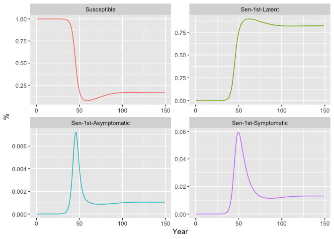

<!-- README.md is generated from README.Rmd. Please edit that file -->


# EndTB

<!-- badges: start -->

[](https://lifecycle.r-lib.org/articles/stages.html#experimental)
<!-- badges: end -->

The goal of EndTB is to provide a convenient set of the established TB
models for the simulation, estimation, and projection of Tuberculosis
Epidemic.

Moreover

- the models are implemented in C++ which provides fast simulations.
- the models are called within the [TMB
  framework](https://kaskr.github.io/adcomp/Introduction.html), allowing
  advanced and fast parameter estimation with emprical Bayes approach.

## Installation

You can install the development version of EndTB like so:

``` r
remotes::install_github('kklot/EndTB')
```

Documents of the package and functions can be view as normal R’s
documentation or online at [EndTB.](https://kklot.github.io/EndTB)

## Example

This is a basic example which shows you how to start a model:

``` r
library(EndTB)
#> Welcome to EndTB
TB <- TBM$new(c(sigma = 2))
```

where the default parameters $\sigma$ was replaced with 2.

Steady-state of the model without treatments and no population growth
for that set of parameters can be ploted with.

``` r
TB$plot()
```



List of states to be plotted can be supplied into the arguments of the
`plot` function above.

Further details can be read in **References** in the top navigation. For
example, [the documentation of
`plot`](https://kklot.github.io/EndTB/reference/TBM.html#method-plot-).

Check out model’s parameters and states for Moldova model.

``` r
EndTB:::states_moldova
#>                        S                      LS1                      AS1 
#>            "Susceptible"         "Sen-1st-Latent"   "Sen-1st-Asymptomatic" 
#>                      IS1                      DS1                      ES1 
#>    "Sen-1st-Symptomatic"      "Sen-1st-Presented"       "Sen-1st-Seekcare" 
#>                      FS1                      LS2                      AS2 
#>          "Sen-1st-Treat"         "Sen-2nd-Latent"   "Sen-2nd-Asymptomatic" 
#>                      IS2                      DS2                      ES2 
#>    "Sen-2nd-Symptomatic"      "Sen-2nd-Presented"       "Sen-2nd-Seekcare" 
#>                      FS2                      RS0                      RS1 
#>          "Sen-2nd-Treat" "Sen-2nd-Recover-Stable"    "Sen-2nd-Relapse-Low" 
#>                      RS2                      LR1                      AR1 
#>   "Sen-2nd-Relapse-High"         "Res-1st-Latent"   "Res-1st-Asymptomatic" 
#>                      IR1                      DR1                      ER1 
#>    "Res-1st-Symptomatic"      "Res-1st-Presented"       "Res-1st-Seekcare" 
#>                      FR1                      LR2                      AR2 
#>          "Res-1st-Treat"         "Res-2nd-Latent"   "Res-2nd-Asymptomatic" 
#>                      IR2                      DR2                      ER2 
#>    "Res-2nd-Symptomatic"      "Res-2nd-Presented"       "Res-2nd-Seekcare" 
#>                      FR2                      RR0                      RR1 
#>          "Res-2nd-Treat" "Res-2nd-Recover-Stable"    "Res-2nd-Relapse-Low" 
#>                      RR2 
#>   "Res-2nd-Relapse-High"
EndTB:::pars_moldova
#>           N      beta_s      beta_r       kappa           b          mu 
#> 2.38428e+07 4.40000e+00 1.20000e+01 1.00000e-01 1.00000e-02 1.50000e-02 
#>       mu_tb     theta_s     theta_r         rho       sigma       delta 
#> 1.50000e-01 1.40000e-01 1.40000e-01 1.00000e-03 7.90000e+00 7.50000e+00 
#>       gamma         phi  varepsilon       omega       tau_0       tau_1 
#> 1.20000e+01 5.20000e+01 9.30000e-01 9.30000e-01 2.00000e+00 5.00000e-01 
#>       chi_s       chi_r      varrho         r_0         r_1         r_2 
#> 2.00000e-01 2.50000e-01 5.00000e-02 3.20000e-02 1.40000e-01 1.50000e-03 
#>         r_3    varsigma        c_s0        c_r0        c_r1         m_n 
#> 7.00000e-01 5.00000e-01 8.00000e-01 3.00000e-01 4.80000e-01 7.40000e-01 
#>         m_r          xi 
#> 4.70000e-01 8.00000e-01
```

## TODO

- [x] 1st revision of the WHO’s model (and currently the only)
- [ ] Revise model to Argentina data
- [ ] Add fitting example
- [ ] Add other model variations
